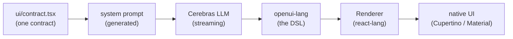

<h1 align="center">AppLess &middot; a phone with no apps. just ask.</h1>

<p align="center">
  Every screen is generated the moment you ask, streamed live, and rendered in
  real native UI: Cupertino on iOS, Material 3 on Android.
</p>

<p align="center">
  <a href="https://openui.com">openui.com</a> &nbsp;&middot;&nbsp;
  <a href="#demo">Demo</a> &nbsp;&middot;&nbsp;
  <a href="#quick-start">Quick start</a> &nbsp;&middot;&nbsp;
  <a href="#how-it-works">How it works</a> &nbsp;&middot;&nbsp;
  <a href="#the-native-migration">Native migration</a>
</p>

<p align="center">
  
  
  
  
  
</p>

> [!NOTE]
> **A native migration is underway.** AppLess is being rewritten as two fully
> native apps — Swift/SwiftUI on iOS and Kotlin/Compose on Android — alongside
> the React Native app, which stays frozen as the behavioral reference. The
> parsers and core runtimes are done and tested; the UI layers are not runnable
> end to end yet. **The React Native app below is the one you can run today.**
> See [the native migration](#the-native-migration) and
> [`docs/MIGRATION_STATUS.md`](docs/MIGRATION_STATUS.md).

---

## Demo

<p align="center">
  
</p>

There are no apps to install, no menus to learn, no home screen full of icons.
You open AppLess and ask for what you want, and the screen for it is generated
on the spot: a weather dashboard, a restaurant list with live search, a booking
form, a chat thread. Tap anything and the next screen is generated too, already
prefetched so it appears instantly.

It is a demo of what a **generative UI operating system** feels like, built
entirely on [OpenUI](https://openui.com), the open standard for LLM-generated
interfaces. The model does not return JSON or hand-written screens; it writes
**openui-lang**, a compact streaming-first UI language that the OpenUI renderer
turns into live, interactive native components.

> [!WARNING]
> **AppLess is an experiment** by the creators of [OpenUI](https://openui.com) to
> push the boundaries of Generative UI, with no real integrations behind it. Screen
> _content_ is generated by the model: turn on the optional web and image tools and
> it can be grounded in real data (real places, prices, news, photos); without them
> it is plausible fiction. The _actions_ are always simulated, though. "Order
> placed", "flight booked", "payment sent", and live health stats do nothing and
> reflect no real state, because nothing is wired up yet. It is a glimpse of what a
> generative-UI OS could feel like, not a working replacement for your apps, at
> least until someone [makes it real](#fork-it-and-make-it-yours).

## Quick start

```bash
git clone https://github.com/thesysdev/appless.git
cd appless
npm install            # postinstall applies the react-lang patch
npm run ios            # or: npm run android, or npm start for Expo Go
```

On first launch the app asks for a free [Cerebras](https://cloud.cerebras.ai)
API key and stores it on-device (Keychain / Keystore). Generation runs straight
from the phone to the model. There is no backend to deploy.

To skip the key prompt during development, or to turn on optional tools, drop a
`.env.local` in the project root:

```bash
EXPO_PUBLIC_CEREBRAS_API_KEY=csk-...    # skip the first-launch key screen
# EXPO_PUBLIC_EXA_API_KEY=              # enable the web_search tool (Exa)
# EXPO_PUBLIC_UNSPLASH_ACCESS_KEY=      # real semantic photos (else LoremFlickr)
# EXPO_PUBLIC_GENOS_MODEL=gemma-4-31b
# EXPO_PUBLIC_CEREBRAS_BASE_URL=        # any OpenAI-compatible endpoint
```

> Expo SDK 54 is pinned to match the Expo Go build on the App Store and Play
> Store. If your Expo Go reports a different SDK, run
> `npx expo install expo@^<version> && npx expo install --fix`.

## How it works



One contract, `ui/contract.tsx`, is the single source of truth for every
component the model can use: its name, its props, and a description. That
contract generates the system prompt, so the model always knows exactly the UI
vocabulary the app can render. As tokens stream back, the OpenUI
[`<Renderer>`](https://openui.com) parses openui-lang incrementally and paints
real native components, live, before the response has even finished.

Two design systems implement that one contract, so the same generated screen
renders as **Cupertino** on iOS and **Material 3** on Android with no change to
the prompt. Tapping a row, chip, or button streams the next screen; the app
speculatively prefetches likely destinations so navigation feels instant.

**Real tools, in the app.** When a screen needs live facts (news, prices, real
places), the model calls a `web_search` tool ([Exa](https://exa.ai)) mid-stream
and composes the screen from the results, sources cited. Images are referenced
as semantic queries the app resolves on-device.

## Packages

AppLess is a thin, native shell over the OpenUI runtime. The heavy lifting is
the OpenUI stack:

| Package | Role |
| --- | --- |
| [`@openuidev/react-lang`](https://openui.com) | The OpenUI runtime: parses streaming openui-lang and renders it through a pluggable component library. The core of the whole app. |
| [`@openuidev/cli`](https://openui.com) | Generates the system prompt from the component contract (`npm run generate:prompt`). |
| [`expo`](https://expo.dev) / [`react-native`](https://reactnative.dev) | The native app runtime (Expo SDK 54, New Architecture). |
| [`react-native-svg`](https://github.com/software-mansion/react-native-svg) | Chart geometry shared across both design systems. |
| [`react-native-webview`](https://github.com/react-native-webview/react-native-webview) | Keyless Google Maps embed for `MapView`. |
| [`expo-linear-gradient`](https://docs.expo.dev/versions/latest/sdk/linear-gradient/) | Card and hero gradients. |
| [`lucide-react-native`](https://lucide.dev) / [`phosphor-react-native`](https://phosphoricons.com) | Icon sets for generated rows and the home shell. |
| [`expo-secure-store`](https://docs.expo.dev/versions/latest/sdk/securestore/) | On-device storage for the user's API key (Keychain / Keystore). |
| [`zod`](https://zod.dev) | Prop schemas in the component contract. |
| [`@react-native-community/slider`](https://github.com/callstack/react-native-slider) | Native slider input for forms. |

Screens are generated by [Cerebras](https://cloud.cerebras.ai); live search is
powered by [Exa](https://exa.ai). Both are bring-your-own-key.

## Design systems

The model-facing contract and the design languages are deliberately separate so
platforms can look native without ever drifting the prompt:

- [`ui/contract.tsx`](src/genos/ui/contract.tsx) - component names, prop schemas,
  and descriptions. The single source that generates the system prompt.
- [`ui/cupertino/`](src/genos/ui/cupertino) - iOS renderers: inset grouped
  lists, icon badges, segmented tabs, iOS switch.
- [`ui/material/`](src/genos/ui/material) - Android renderers: Material 3 tonal
  surfaces, ripple, filter chips, underline tabs, native switch.
- [`ui/shared/`](src/genos/ui/shared) - chart, map, form, and image logic shared
  by every design system.

The native ports keep the same split. `spec/contract/genos.schema.json` replaces
`contract.tsx` as the machine-readable source, and each port derives its
renderer set from it rather than hard-coding a list - so a component added to
the contract fails both ports' conformance gates until someone implements it.

## Repository layout

The repo holds the running React Native app and the in-progress native ports
side by side, with a shared, platform-neutral spec between them.

```
appless/
├── src/, App.tsx, __tests__/   RN app (Expo SDK 54) — runnable today, and the
│                               behavioral reference the ports are graded against
├── spec/                       platform-neutral source of truth
│   ├── openui-lang.md            the grammar + streaming semantics
│   ├── contract/                 the 33-component contract as JSON Schema
│   ├── prompt/                   the system prompt, assembled from sections
│   ├── icon-map.md               icon name -> SF Symbol / Material Symbol
│   └── fixtures/                 97 golden fixtures: .oui -> .expected.json
├── ios/                        Swift
│   ├── Packages/OpenUILang/      streaming openui-lang parser
│   ├── Packages/GenOSCore/       store, controller, SSE client, tool loop, tools
│   └── AppLess/                  AppLessCore (pure Swift) + AppLessUI (SwiftUI)
├── android/                    Kotlin
│   ├── openui-lang/              the parser port
│   ├── genos-core/               the core port
│   ├── ui-core/                  M3 tokens, icon map, renderer logic (pure JVM)
│   └── app/                      the Compose app
└── docs/                       the plan and the live status
```

The trick that keeps three implementations honest: **`spec/fixtures/` is
generated from the real react-lang parser**, and both native parsers are graded
against that same corpus. Nobody's reading of the grammar is authoritative — the
running RN parser is.

## The native migration

Two fully native apps, no React Native runtime, both rendering the same
generated openui-lang the same way: Cupertino on iOS, Material 3 on Android.

**Where it stands** — measured, not estimated:

| | Status |
|---|---|
| Shared spec, contract schema, prompt, 97-fixture corpus | done, gated in CI |
| Swift parser (`OpenUILang`) | done — 97/97 fixtures |
| Swift core (`GenOSCore`) | done — 203 tests |
| Swift `AppLessCore` (tokens, icon map, chart/form/shell logic) | done — 220 tests |
| SwiftUI app (30 renderers + shell) | **written, not yet verified** — SwiftUI cannot compile on Linux; the first real compile happens on macOS CI |
| Kotlin parser (`openui-lang`) | done — 121 tests |
| Kotlin core (`genos-core`) | done — 279 tests |
| Kotlin `ui-core` (M3 tokens, icon map, renderer logic) | done — 95 tests |
| Compose app (`android/app`) | **in flight** — compiles and passes 71 unit tests, but no Compose code is executed by a test and no CI workflow gates it |

**Neither native app runs end to end yet.** No simulator, emulator or device has
launched either one; no native build has talked to the model. What is done is
the hard, testable half — two independent parser and runtime ports that
byte-match the JS reference — and that half is genuinely done.

Authoritative status, including everything that is *not* verified anywhere,
lives in **[`docs/MIGRATION_STATUS.md`](docs/MIGRATION_STATUS.md)**. The design
is in [`docs/NATIVE_MIGRATION_PLAN.md`](docs/NATIVE_MIGRATION_PLAN.md).

## Tests

**The React Native app:**

```bash
npm test    # renders exemplar generated screens through the full
            # parser -> Renderer -> native component pipeline (jest-expo,
            # headless), for both Cupertino and Material renderer sets
```

**The shared spec** — regenerates the fixture corpus from the real parser and
checks it is byte-identical to what is committed:

```bash
cd spec/fixtures/generator && npm ci && npm test
```

**The Swift side** — needs a Swift 6.1 toolchain; runs on Linux or macOS:

```bash
cd ios/Packages/OpenUILang && swift test    # parser, 97 fixtures
cd ios/Packages/GenOSCore   && swift test   # store, stream, tool loop
cd ios/AppLess              && swift test   # AppLessCore
```

On Linux, `AppLessUI` compiles to an **empty module** — every file is behind
`#if canImport(SwiftUI)`. Only macOS CI (`.github/workflows/ios-app.yml`)
actually compiles the SwiftUI.

**The Kotlin side** — needs JDK 21; these three modules are pure JVM and need no
Android SDK:

```bash
cd android && ./gradlew :openui-lang:test :genos-core:test :ui-core:test
```

`:app` needs the Android SDK and is mid-write; it builds and tests locally with
`./gradlew :app:assembleDebug :app:testDebugUnitTest` but is not gated by CI.

**Cross-port differential fuzzing** — feeds generated programs through both
ports and the JS oracle and byte-compares the results:

```bash
cd spec/fixtures/generator && node probes/run-differential.mjs
```

CI runs all of the Linux-runnable gates above on every push via
`.github/workflows/all-gates.yml`.

## Fork it and make it yours

The actions and state are simulated only because nothing is wired to a real
service yet, and that missing piece is usually just one integration. We would
love for you to fork AppLess and make it real:

- **Real food ordering** - wire in the DoorDash or Uber Eats API and the food
  screens order you actual dinner.
- **A real Yelp** - add the Google Places API so "restaurants nearby" returns
  real venues, hours, photos, and reviews.
- **A real wallet** - connect Plaid and the banking screens show your real
  balance and transactions.
- **A real day** - hook up the Google Calendar API and "what does my day look
  like" becomes actually your day.
- **Real music** - drop in the Spotify API and the player controls real playback.

Pick a screen, give the model a tool that returns real data and somewhere to send
the action, and the demo turns into a working app. Open a PR - we would love to
see what you build.

## Learn more

AppLess is one of many things you can build on OpenUI. To use the same
generative-UI stack in your own product, start at **[openui.com](https://openui.com)**
and the [OpenUI repository](https://github.com/thesysdev/openui).

## Telemetry

AppLess sends one anonymous `appless_app_launched` event to
[PostHog](https://posthog.com) on startup, so we can see how many people build
and run the experiment. It carries
only an anonymous per-device id and your platform (iOS / Android / web). No
prompts, screen content, API keys, or personal data are ever collected. Opt out
any time:

```bash
EXPO_PUBLIC_POSTHOG_DISABLED=1   # or the standard DO_NOT_TRACK=1
```

## License

MIT. See [LICENSE](LICENSE).
